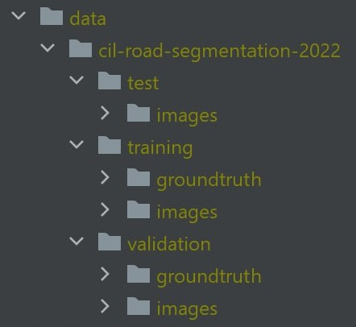

# CIL-road-segmentation
Task: Given a sattelite image return the estimated road segmentation.  
Some useful Links:
- [General Info](https://docs.google.com/document/d/1T5EjTYempPQng1BecGolbLtN5LtCL_xwq2PmmM-mAJ0/edit)
- [Task Description](https://docs.google.com/document/d/1MVRFu4oKWgAluY7CRzehFH8Pt-TNSW_9JJ6E9gmraZg/edit)
- [Kaggle 2021](https://www.kaggle.com/c/cil-road-segmentation-2021)
- [Data CIL 2022](https://polybox.ethz.ch/index.php/s/AGkDmbC8IfmtBkr/authenticate)

## Setup (With Training)
1. Download datasets
2. Create the following data-file structure and save your data into the folders:  

## Setup (Only Inference)
1. TODO
